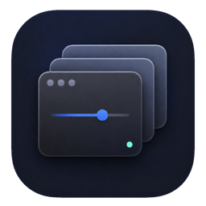
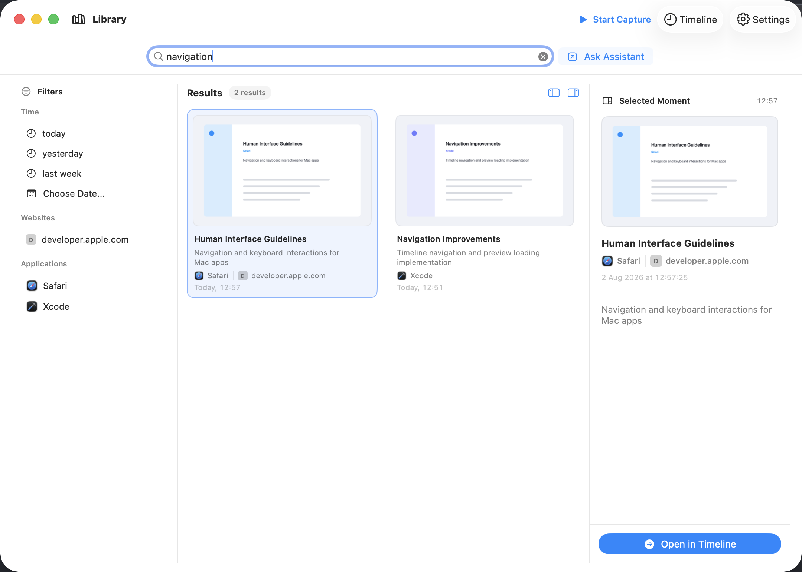
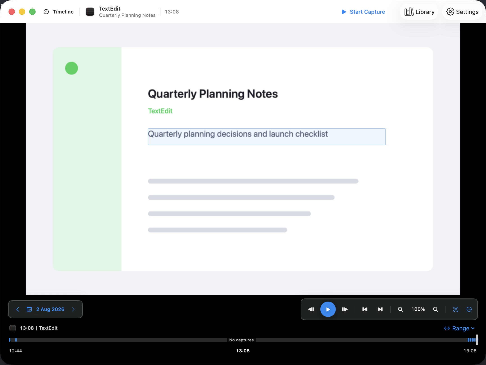
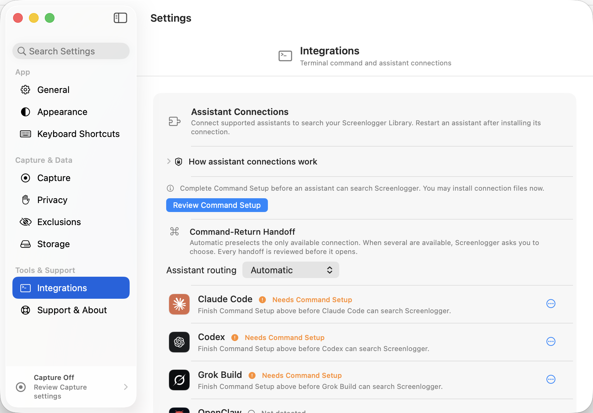

<p align="center">
  
</p>

<h1 align="center">Screenlogger</h1>

<p align="center">
  A private, searchable screen memory for macOS.
</p>

<p align="center">
  <a href="https://github.com/radkawar/screenlogger/releases/download/v0.1.3/Screenlogger-v0.1.3-macos-universal.dmg"><strong>Download Screenlogger v0.1.3</strong></a>
  <br>
  macOS 14 or later. Universal, Developer ID signed, and notarized by Apple.
</p>



Screenlogger captures at an interval you choose, recognizes visible text on
device, and lets you return to a moment through Library search or Timeline
navigation. Capture and search stay on your Mac.

## Highlights

- Search recognized text, applications, websites, and dates.
- Move between Library results and their surrounding Timeline context.
- Pause capture at any time and exclude applications or websites.
- Keep the Library on this Mac with retention, compaction, backup, and restore.
- Search from Terminal with the `screenlog` command.
- Hand a reviewed search request to Claude Code, Codex, Cursor, Grok Build, or
  OpenClaw.
- Check, install, and relaunch into cryptographically signed updates from the
  app. Automatic checks remain off until enabled in Settings.

## Timeline and assistants

| Review a moment in context | Connect the tools you already use |
| --- | --- |
|  |  |
| Move through nearby activity, inspect recognized text, and jump between moments. | Route a Library search to Claude Code, Codex, Cursor, Grok Build, or OpenClaw. |

Screenshots use sample activity generated by the UI test fixture.

## Install

Screenlogger requires macOS 14 or later.

1. [Download the latest DMG](https://github.com/radkawar/screenlogger/releases/download/v0.1.3/Screenlogger-v0.1.3-macos-universal.dmg).
2. Open the DMG and drag Screenlogger into Applications.
3. Open Screenlogger from Applications.
4. Follow Setup to allow Screen Recording and Accessibility. Both permissions
   are required for reliable capture and exclusions.
5. Choose Start Capture.

See [Installation](docs/INSTALLATION.md) for detailed first-run and removal
instructions.

## Privacy

The Library is stored under:

```text
~/Library/Application Support/dev.screenlog/
```

Screen capture, text recognition, indexing, and search run on this Mac. Optional
website-icon fetching is off by default and can be disabled globally with Keep
Screenlogger Offline. Only the search words and visible filters are handed off.
The selected assistant may send retrieved material to its AI provider.

Read [Privacy](docs/PRIVACY.md) for permission, storage, exclusion, network, and
assistant boundaries.

## Command line

Install the Terminal command from Screenlogger Settings, then keep the app open:

```sh
screenlog doctor
screenlog search "design review"
screenlog usage top-applications
screenlog --help
```

The app owns the database. The CLI is a bounded client and never opens the
Library database directly. See [CLI](docs/CLI.md) and
[Assistant integrations](docs/ASSISTANTS.md).

## Build from source

Full Xcode is required.

```sh
export DEVELOPER_DIR=/Applications/Xcode.app/Contents/Developer
Scripts/xcodegen.sh generate
swift test
Scripts/build.sh
```

The checked-in Xcode project is generated from `project.yml`. CI verifies that
the generated project is current.

## Documentation

- [Installation](docs/INSTALLATION.md)
- [Privacy](docs/PRIVACY.md)
- [CLI](docs/CLI.md)
- [Assistant integrations](docs/ASSISTANTS.md)
- [Architecture](docs/ARCHITECTURE.md)
- [Development](docs/DEVELOPMENT.md)
- [Performance](docs/PERFORMANCE.md)
- [Backup and restore](docs/BACKUP_AND_RESTORE.md)
- [Troubleshooting](docs/TROUBLESHOOTING.md)
- [Release process](docs/RELEASING.md)
- [Interface style](docs/styling.md)

## Contributing

Read [CONTRIBUTING.md](CONTRIBUTING.md) before opening a change. Security issues
should follow [SECURITY.md](SECURITY.md).

## License

Screenlogger is available under the MIT License. See [LICENSE](LICENSE) and
[THIRD_PARTY_NOTICES.md](THIRD_PARTY_NOTICES.md).
